# LoopKit 🔄

> **The Open-Source Standard for Autonomous AI Agent Loops**
> Compose. Verify. Deploy.

[](LICENSE)
[](runtime/)
[](src/)

---

## Why LoopKit?

Every team building AI agents is reinventing the same wheel — designing loops,
wiring up Maker/Checker verification, managing state across sessions, handling
failure recovery. **There is no standard.**

LoopKit is that standard. Inspired by what React did for UI components and what
Docker did for containers, LoopKit gives you:

- **Six composable primitives** — Trigger, Pipeline, Skill, Connector, SubAgent, Memory
- **Built-in Maker/Checker** — Verification is in the architecture, not an afterthought
- **Loop Readiness Score (LRS)** — Know if your loop is production-ready before you run it
- **Dual runtime** — TypeScript CLI + Python execution engine

## Demo



Try it yourself:

```bash
# Install Python runtime
cd runtime && pip install -e .

# Run a code review loop (dry run — no LLM cost)
loopkit-runtime --dry-run run pr-review
```

```
============================================================
  Running Loop: pr-review
============================================================
Config: loops\pr-review.yaml
Pipeline: 1 step(s)
Verification: Maker=['Bug Review', 'Security Review',
              'Quality Review', 'Performance Review']
              | Checker=Adversarial Verifier

── Pipeline Execution ────────────────────────────────
  Running 4 agents in parallel...
  -> Agent: Bug Review...
  -> Agent: Security Review...
  -> Agent: Quality Review...
  -> Agent: Performance Review...
    + Completed (424ms, 0 up/0 down tokens, $0.0000)

── Maker/Checker Verification ────────────────────────
  Round 1: [ok] PASS (score: 0.95)

── Results ───────────────────────────────────────────
[ok] Loop 'pr-review' completed successfully
  Duration: 424ms
  Steps: 4
  Est. Cost: $0.0000
```

## Quick Start

```bash
# 1. Install
npm install -g loopkit

# 2. Initialize a project
loopkit init

# 3. Validate
loopkit validate

# 4. Run a loop (requires ANTHROPIC_API_KEY or OPENAI_API_KEY)
loopkit-runtime run pr-review
```

## Example: PR Review Loop

```yaml
# loops/pr-review.yaml
name: pr-review
trigger:
  type: webhook
  event: pull_request

pipeline:
  - parallel:
      - prompt: "Review for correctness bugs"
        label: Bug Review
      - prompt: "Review for security vulnerabilities"
        label: Security Review
      - prompt: "Review for code quality"
        label: Quality Review

verify:
  maker: [Bug Review, Security Review, Quality Review]
  checker: Adversarial Verifier
  maxRounds: 3
  autoRetry: true

budget:
  maxTokens: 500000
  maxDurationMinutes: 30

memory:
  store: filesystem
  path: .loopkit/state
```

## Architecture

```
┌── User ──────────────────────────────────┐
│  loopkit.yaml        loops/              │  ← Declarative YAML
└────────┬──────────────────────┬───────────┘
         │                      │
    ┌────▼──────────────┐ ┌────▼──────────┐
    │  TypeScript CLI   │ │ Python Runtime │   ← Dual runtime
    │  (init/validate   │ │ (execution     │
    │   /run/status)    │ │  engine)       │
    └───────────────────┘ └────┬───────────┘
                               │
                    ┌──────────▼──────────┐
                    │   Loop Engine       │
                    │                     │
                    │  ┌───────────────┐  │
                    │  │ Pipeline      │  │
                    │  │ ┌───┐ ┌───┐   │  │
                    │  │ │ A │ │ B │…  │  │  ← Parallel agents
                    │  │ └─┬─┘ └─┬─┘   │  │
                    │  └───┼─────┼─────┘  │
                    │      │     │        │
                    │  ┌───▼─────▼─────┐  │
                    │  │  Verifier     │  │  ← Maker/Checker
                    │  │  (Checker)    │  │
                    │  └───────┬───────┘  │
                    └──────────┼──────────┘
                               │
                    ┌──────────▼──────────┐
                    │    State Store      │  ← Filesystem persistence
                    │  .loopkit/state/    │
                    └─────────────────────┘
```

## The Six Primitives

| Component | Role | Examples |
|-----------|------|---------|
| **Trigger** | What starts the loop | cron, webhook, manual, event |
| **Pipeline** | The execution flow | parallel, sequential, conditional |
| **Skill** | Reusable domain knowledge | SKILL.md, npm packages |
| **Connector** | External system bridge | MCP servers, APIs, databases |
| **SubAgent** | Maker/Checker separation | planner, executor, verifier |
| **Memory** | Cross-session persistence | filesystem, database, memory |

## Loop Readiness Score (LRS)

Each loop receives a 0-100 score across 7 dimensions:

```
loopkit validate
  
  pr-review    — LRS: 85/100 (Grade B)
    [ok] Maker/Checker separation enforced
    [ok] Budget controls configured (3 dimensions)
    [!] State persistence recommended

  daily-triage — LRS: 72/100 (Grade C)
    [ok] Max iterations set
    [!] Add budget controls for production
    [!] Verification missing
```

## Roadmap

- **Phase 1** (current): Schema + CLI + LRS + Python Runtime
- **Phase 2** (W3-4): Loop Registry, GitHub Action, MCP integration
- **Phase 3** (W5-8): Team collaboration, observability dashboard, audit logs
- **Phase 4** (Q3): Enterprise SSO, compliance reporting, on-premise deployment

## Why This Matters

> *"I stopped manually prompting Claude. I run a bunch of Loops to prompt it
> and let it decide what to do next. My job has become writing Loops."*
> — **Boris Cherny**, Claude Code lead, Anthropic

Loop Engineering is the fourth paradigm shift in AI engineering:

| Era | Focus |
|-----|-------|
| Prompt Engineering (2022) | Write better prompts |
| Context Engineering (2023) | Give better context |
| Tool Engineering (2024) | Build better tools |
| **Loop Engineering (2025+)** | **Design better loops** |

## License

MIT — see [LICENSE](LICENSE)
